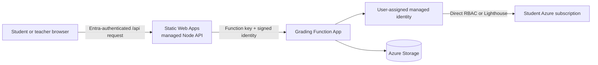

# Azure Automatic Grading Engine

Azure Automatic Grading Engine is a secretless, multi-tenant platform for
grading Azure infrastructure assignments through the Azure Isekai learning
game. Students work in their own subscriptions; the platform uses one
user-assigned managed identity and never stores student credentials.

## Start Here

Use the [documentation index](docs/index.md) to choose a role or task.

- **Student:** [same-tenant](docs/getting-started/student-same-tenant.md) or
  [cross-tenant](docs/getting-started/student-cross-tenant.md) onboarding
- **Teacher:** [teacher onboarding](docs/getting-started/teacher.md) and
  [class performance dashboard](docs/guides/teacher-dashboard.md)
- **Operator:** [deployment](docs/operations/deployment.md) and
  [troubleshooting](docs/operations/troubleshooting.md)
- **Developer:** [development guide](docs/development/development.md) and
  [API reference](docs/reference/api.md)
- **Questions:** [FAQ](docs/faq.md)

## Architecture



Key boundaries:

1. Static Web Apps controls application sign-in.
2. The managed API derives and signs the trusted principal.
3. Atomic registration indexes bind one email to one subscription.
4. The Function and hosted NUnit runner use the managed identity.
5. Classes control teacher reporting scope only; they never affect grading.

See [Technical design](docs/architecture/technical-design.md) and
[Static Web Apps API topology](docs/architecture/static-web-apps-api.md).

## Repository Layout

| Path | Purpose |
| --- | --- |
| `GraderFunctionApp/` | Grading, game, registration, and teacher Functions |
| `GraderFunctionApp.Tests/` | NUnit unit and component tests |
| `GraderFunctionApp.IntegrationTests/` | Deployed HTTP and lifecycle checks |
| `AzureProjectTest/` | Hosted NUnit runner |
| `AzureProjectTestLib/` | Public grading-test submodule |
| `azure-isekai/` | RPG frontend and managed Node API submodule |
| `Infrastructure/` | CDK Terrain deployment and operational scripts |
| `packages/` | Shared provider and construct submodules |
| `docs/` | Task-oriented project documentation |

## Quick Deployment

```bash
git submodule update --init --recursive
npm run bootstrap
cp Infrastructure/.env.template Infrastructure/.env
az login --use-device-code

cd Infrastructure
npx cdktn deploy --auto-approve
az functionapp restart \
  --resource-group GradingEngineAssignmentResourceGroup \
  --name azureisekai2026
npm run storage:seed
npm run frontend:deploy
```

Complete the environment, sign-in roster, verification, and recovery steps in
the [deployment guide](docs/operations/deployment.md).

## Validation

```bash
dotnet test AzureProjectGrader.sln --configuration Release
npm --prefix azure-isekai/api test
npm --prefix Infrastructure test
npm --prefix Infrastructure run build
npm --prefix Infrastructure run synth
terraform \
  -chdir=Infrastructure/cdktf.out/stacks/AzureAutomaticGradingEngineGrader \
  validate
```

After deployment:

```bash
scripts/test-deployed-function.sh \
  GradingEngineAssignmentResourceGroup \
  azureisekai2026
```

## Security Invariants

- Never accept browser-supplied student identity.
- Never expose Function or proxy-signing keys to frontend JavaScript.
- Never fall back from registration indexes to mutable Azure tags.
- Keep email and subscription indexes in one transaction.
- Keep task state and the active-task lock in one student partition.
- Require `ADMIN_EMAILS` at both managed proxy and Function boundaries.
- Keep the Static Web Apps portal linked-backend mapping empty; the project
  uses the managed Node API.

## License and Support

See [LICENSE](LICENSE). Operational questions should begin with the
[FAQ](docs/faq.md) and [troubleshooting guide](docs/operations/troubleshooting.md).
