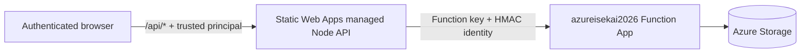

# Static Web Apps API Topology

Azure Isekai uses two API layers with different responsibilities.



## Managed API

The code under `azure-isekai/api` is deployed with the frontend as the Azure
Static Web Apps managed Node API. It:

- receives the trusted Static Web Apps principal;
- normalizes the signed-in email;
- prevents callers from selecting another identity;
- checks the teacher allowlist for `/api/teacher/*`;
- removes `?code=` from configured Function URLs;
- forwards the Function key in a header;
- signs the method, backend path/query, timestamp, and email.

The anonymous `/api/health` route proves this API package is executing.

## Grading Function App

`azureisekai2026` is a separately deployed Azure Function App. It:

- requires Function-level authorization;
- validates the HMAC identity assertion;
- independently enforces `ADMIN_EMAILS` for operator endpoints;
- owns game, grading, registration, class-performance, and storage logic.

The Function App is reached through server-side `*FunctionUrl` Static Web Apps
settings. Keys are never sent to browser JavaScript.

## Why Portal API Mapping Is Empty

Azure Portal **Static Web App > Settings > APIs** configures Bring Your Own API
backends. This project uses the managed API, so `linkedBackends` is
intentionally empty.

Do not link `azureisekai2026` directly. Azure Static Web Apps supports one API
backend type per environment; linking the Function App would replace the
managed proxy and bypass its identity transformation.

## Production Verification

```bash
curl -fsS "https://<static-web-app-host>/api/health" |
  jq -e '.status == "ok" and .service == "azure-isekai-api"'
```

Expected linked-backend count:

```bash
subscription_id="$(az account show --query id --output tsv)"
az rest --method GET --url \
  "https://management.azure.com/subscriptions/$subscription_id/resourceGroups/GradingEngineAssignmentResourceGroup/providers/Microsoft.Web/staticSites/azure-isekai-grading-web/builds/default/linkedBackends?api-version=2023-12-01" \
  --query 'length(value)'
```

Expected result: `0`.

The supported deployment command performs the managed API health check:

```bash
cd Infrastructure
npm run frontend:deploy
```

See [Deployment](../operations/deployment.md) and
[API reference](../reference/api.md).
