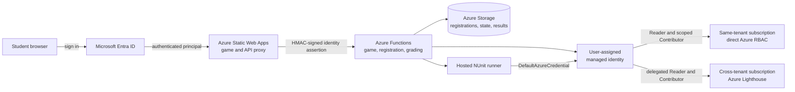
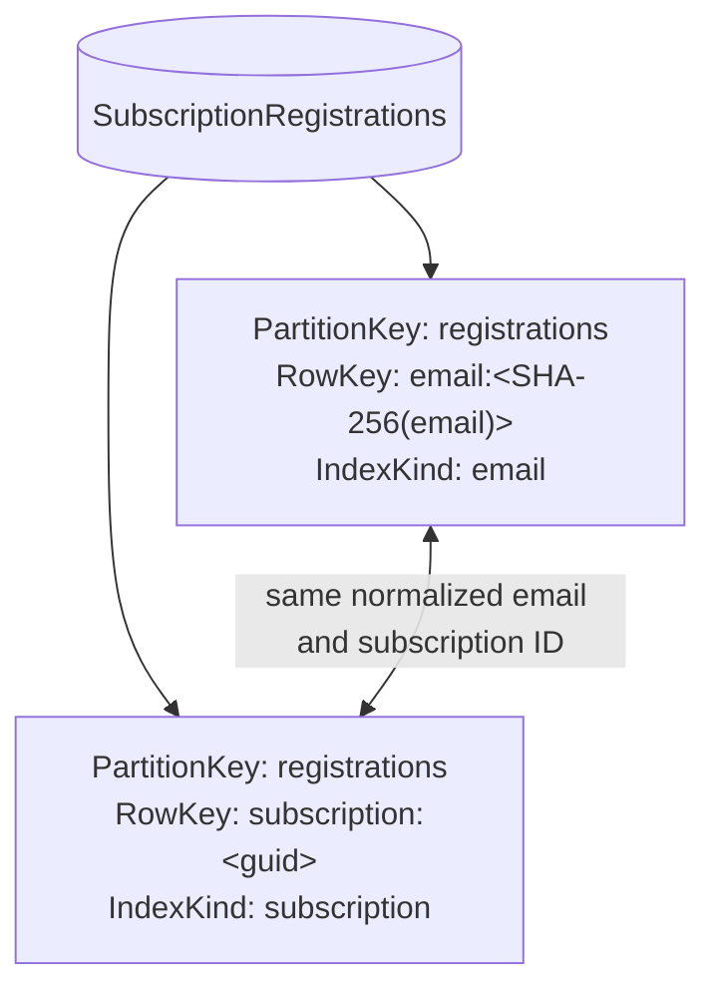
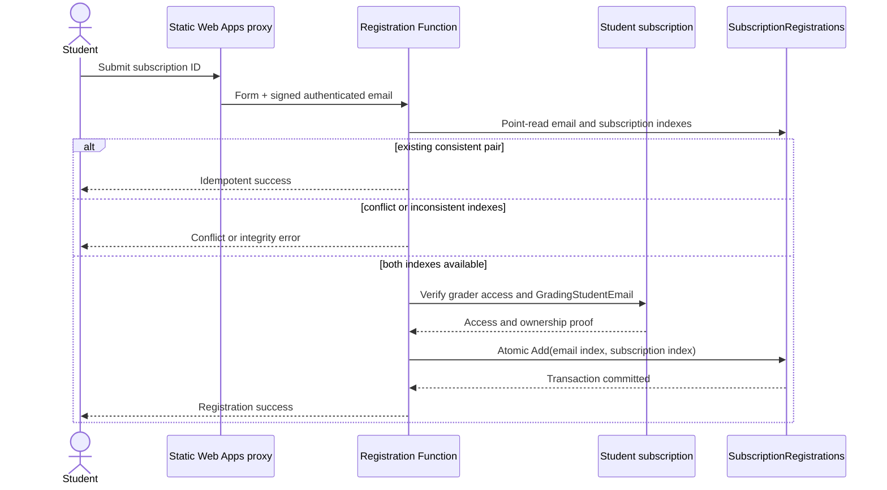
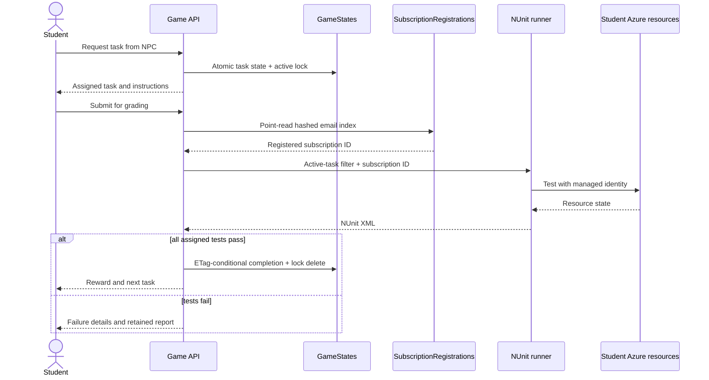

# Secretless Multi-Tenant Azure Grading: Technical Design

Azure Isekai grades infrastructure in student-owned Azure subscriptions without
collecting student credentials. The design separates four concerns that are
often incorrectly combined:

1. **Game sign-in** decides who may use the learning application.
2. **Azure onboarding** grants one managed identity least-privilege access.
3. **Subscription registration** binds an authenticated student to one
   subscription.
4. **Grading** executes only the tests assigned to that student's active task.

This separation is the central security property: authenticating to the game
does not grant Azure access, and Azure access alone does not select which
student owns a subscription in the application database.

## System Architecture



Static Web Apps is the public identity boundary. Its server-side API reads the
trusted Entra principal, normalizes the email, and signs the email, HTTP
method, exact backend path/query, and timestamp. The Function rejects missing,
expired, malformed, or replayed assertions. Browser-supplied `email`, form
email, and diagnostic values never select another student's data.

The Function key and HMAC key serve different purposes:

- The Function key limits which services can invoke the backend.
- The HMAC assertion proves which authenticated student the proxy observed.

A Function key without a valid identity assertion is insufficient.

Operator HTTP endpoints add another fail-closed decision. The signed email must
appear in the Function App's `ADMIN_EMAILS` allowlist; an otherwise valid
student assertion receives `403` before cache, generation, or reset services
run. This protects the control plane even if a route is exposed accidentally.

## Secretless Azure Access

The Function App and hosted test process use the same user-assigned managed
identity through `DefaultAzureCredential`.

| Subscription relationship | Access mechanism |
| --- | --- |
| Same Entra tenant as the grader | Direct subscription `Reader`; `Contributor` on `projProd` |
| Different Entra tenant | Azure Lighthouse subscription `Reader`; resource-group `Reader` and `Contributor` |

Students run onboarding from Azure Cloud Shell while signed in to their own
subscription. No service principal, client secret, certificate, or student
password is sent to or stored by Azure Isekai.

The onboarding script creates or validates `projProd`, grants the appropriate
access mode, and sets `GradingStudentEmail`. That tag proves control only for
the initial registration. It is not consulted for routine grading and cannot
transfer an existing database claim.

## Atomic One-to-One Registration

Registration must enforce both sides of the relationship:

```text
one normalized email <-> one normalized subscription ID
```

Azure Table Storage has no secondary unique indexes, so the design writes two
entities in the same partition and transaction:



Hashing the email in the row key allows an exact point read without placing
the address in the key. Both entities still carry the normalized values so
every read and administrative release can validate the pair.



Important failure behavior:

- An email or subscription conflict returns `409` without revealing the other
  student's identifier.
- A partial or disagreeing pair returns `500`; the system does not guess which
  row is authoritative.
- A concurrent claim is reread and classified as idempotent, conflict, or
  integrity failure.
- Grading performs an exact hashed-email point read. It never scans for a
  matching legacy row or falls back to an Azure tag.

## Grading and Concurrency



All game-state rows for a student share one partition. Task assignment writes
the NPC state and fixed active-task lock atomically. Completion rereads current
state after test execution and uses ETags, preventing delayed requests from
overwriting a newer task or awarding a reward twice.

## Reset, Release, and Reassignment

These operations intentionally have different scopes:

| Operation | Removes | Preserves |
| --- | --- | --- |
| Progress reset | Game states, active lock, passed-test progress | Registration, failed attempts, reports, Azure access |
| Registration release | Both registration indexes | Progress, reports, Azure access, tags |
| Azure offboarding | Direct RBAC or Lighthouse delegation and initialization tag | `projProd` and assignment resources |

A safe reassignment runs Azure offboarding, atomic registration release, new
student onboarding, verification, and new web registration in that order.

## Deployment Safety

CDK Terrain provisions deterministic Azure resources and uploads the Function
and hosted test runner. Static Web Apps deployment is separate because it
refreshes runtime Function URLs, keys, Entra settings, and the shared HMAC key.

The Function uses `WEBSITE_RUN_FROM_PACKAGE`. After publishing a new package,
restart the Function App and verify the mounted `appsettings.json` declares
`SubscriptionRegistrationsTableName`. This prevents an old mounted package
from recreating or writing an obsolete table even when a newer package has
already been uploaded.

## Design Lessons

1. **Treat identity, authorization, ownership, and progress as separate
   domains.**
2. **Use two transactional indexes when the data store has no unique secondary
   index.**
3. **Fail closed on inconsistent security mappings; never add a legacy
   fallback.**
4. **Use initialization metadata only to prove the first claim, not as a
   mutable runtime authority.**
5. **Bind service-to-service identity assertions to method, path, query, and
   time—not only to a username.**
6. **Verify the running artifact, not only the deployment command's success
   status.**

For operational procedures, see the
[subscription registration workflow](subscription-registration.md),
[deployment guide](../DEPLOYMENT.md), and
[student grading-access verifier](verify-student-grading-access.md).
